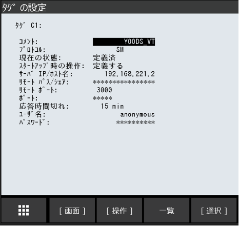
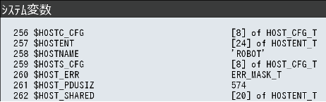
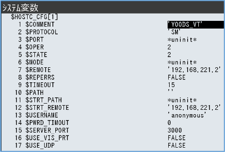
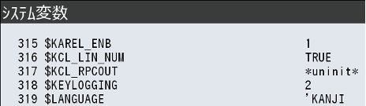
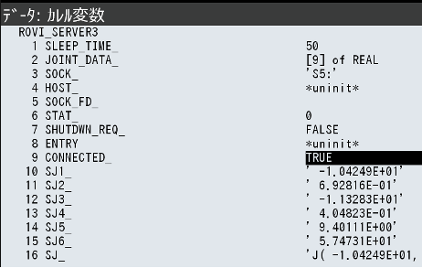
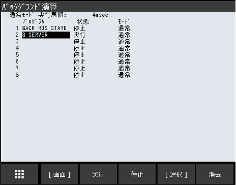
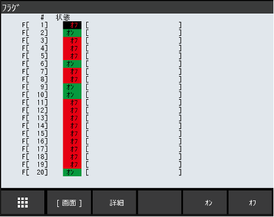

| VTチュートリアル ロボット接続編(FANUC) | Revision      | 第2版 |
| -------------------------------------- | ------------- | ----- |
| 作成者                                 | 株式会社YOODS |       |
| 作成日                                 | 2023年5月25日 |       |
| 最終更新日                             | 2024年2月29日 |       |

# 7.プログラムのロード ( FANUC )

| No   | 手順                                                                                                                                                                                    | 補足                                                                                                                                                                                                                                                           |
| ---- | --------------------------------------------------------------------------------------------------------------------------------------------------------------------------------------- | -------------------------------------------------------------------------------------------------------------------------------------------------------------------------------------------------------------------------------------------------------------- |
| A140 | PCデスクトップ「VTマニュアル」のリンクを選択して ダブルクリックしてください。    使用するロボットメーカーのフォルダを開き  「Robot_program」のフォルダを開いてください。 | ロボットへ必要なプログラムファイルを移行します。  TPプログラム ●vt_main.tp ●vt.move.tp ●r_calib.tp ●b_server.tp  PCプログラム ●rovi_capture.pc ●rovi_detect.pc ●rovi_recipe.pc ●rovi_reset.pc ●rovi_solve.pc ●rovi_serever3.pc             |
| A141 | PCへUSBメモリを挿してください。   選択したフォルダ内のファイルを 全てUSBへ コピーしてください。    コピー完了後、USBを抜いてください。                                   | USBメモリフォルダは自動で出てきますが 出ない場合、ファイルマネージャーを開いて デバイス内のUSBフォルダを開いてください。    USBを抜く際は、ファイルマネージャー左側メニュー                      デバイス内にあるUSBの マークを押してから抜いてください。 |
| A142 | TPへUSBメモリを挿して USB内のファイルを全てTPへ ロードしてください。  完了後、USBメモリを抜いてください。                                               | TPのUSB差し込み口は ロボットメーカー取扱い説明書を参照してください。                                                                                                                                                                                           |

# 8.TPでの通信設定 ( FANUC )

| No   | 手順                                                                                                                                                                                                                                      | 補足                                                                                                                                                                                                          |
| ---- | ----------------------------------------------------------------------------------------------------------------------------------------------------------------------------------------------------------------------------------------- | ------------------------------------------------------------------------------------------------------------------------------------------------------------------------------------------------------------- |
| A150 | PCと通信するために ロボットIPアドレス等を設定していきます。                                                                                                                                                                               | バージョンによって操作方法が違うので、 ロボット取扱い説明書を参照してください。                                                                                                                          |
| A151 | TPの 「画面選択」 ボタンを押してください。 「設定」 メニューから 「ホスト通信」 を 選んでください。                                                                                                                                  | aaa                                                                                                                                                                                                           |
| A152 | 「表示」 を選択して 「プロトコル」 を選んでください。                                                                                                                                                                                     |                                                                                                                                                                                                               |
| A153 | プロトコル設定の 「TCP/IP詳細設定」 を 選んで ロボットIPアドレス、サブネットマスクを 入力してください。   ロボットIPアドレスを設定  例) 192.168.221.10 サブネットマスクを設定 255.255.255.0                                |                                                                                                                                                                                                               |
| A154 | 「前戻」 ボタンで前画面に戻り 「表示」 を選択して 「クライアント」 を選んでください。    ﾀｸﾞ1 C1:を選択して右記設定を 入力してください。 入力後、 「操作」 ボタンを押して 「定義する」 を選択、 実行してください。 |  ｺﾒﾝﾄ  : YOODS_VT  ﾌﾟﾛﾄｺﾙ  : SM  ｽﾀｰﾄｱｯﾌﾟ時の操作 :定義する  IP/ﾎｽﾄ名 : 192.168.221.2  ﾘﾓｰﾄﾎﾟｰﾄ : 3000 |
| A155 | 「前戻」 ボタンで前画面に戻り 「表示」 を選択して 「サーバ」 を選んでください。    ﾀｸﾞ5 S5:を選択して右記設定を 入力してください。                                                                                           | ｺﾒﾝﾄ  : YOODS_VT ﾌﾟﾛﾄｺﾙ  : SM  ｽﾀｰﾄｱｯﾌﾟ時の操作 :スタートする  応答時間切れ : 1 min                                                                                          |
| A156 | 入力後、「操作」 ボタンを押して 「定義する」 → 「スタートする」の順で 選択、実行してください。                                                                                                                                      | 9.システム変数設定 ( FANUC )                                                                                                                                                                                  |

| No   | 手順                                                                                                                                                                                                                                                         | 補足                                              |
| ---- | ------------------------------------------------------------------------------------------------------------------------------------------------------------------------------------------------------------------------------------------------------------ | ------------------------------------------------- |
| A160 | TPの 「画面選択」 ボタンを押してください。 「システム」 メニューから 「システム変数」 を  選んでください。                                                                                                                                         |                                                   |
| A161 | 「$HOST**C** _CFG」 を選び A154で選択したタグ番号を 開いてください。  （ デフォルト：1 [1]）                                                                                                                                                 |  |
| A162 | A154で入力した内容が反映されているか 確認してください。 $COMMENT : YOODS_VT $ PROTOCOL  : SM  $OPER : 2 (定義する) $ STATE : 2 (定義済)  $REMOTE : 192.168.221.2 $ STRT_REMOTE : 192.168.221.2  $SERVER_PORT : 3000 |  |
| A163 | 「$KAREL_ENB」　を選び 「1」を 入力してください。                                                                                                                                                                                                            |  |

# 10.通信の実行と確認 ( FANUC )

| No   | 手順                                                                                                                       | 補足                                              |
| ---- | -------------------------------------------------------------------------------------------------------------------------- | ------------------------------------------------- |
| A170 | TPの 「画面選択」 ボタンを押してください。 「設定」 メニューから 「バックグランド演算」 を  選んでください。     |                                                   |
| A171 | 空いている番号にカーソルを合わせて 「選択」 ボタンを押してください。                                                  |  |
| A172 | 「プログラム」 の中から ロードしたプログラム 「B_SERVER」 を 選択してください。                                       |                                                   |
| A173 | 設定ができたら 「実行」 を押した後、 電源再投入してください。 電源再投入後、プログラムが実行されているか 確認します。 | VTが起動、接続されている状態で ご確認ください。   |
| A174 | プログラム 「一覧」 ボタンを押して 「タイプ」 から 「カレル」 を選択してください。                                    |                                                   |

| No   | 手順                                                                                                                                                                                                            | 補足                                                                                            |
| ---- | :-------------------------------------------------------------------------------------------------------------------------------------------------------------------------------------------------------------- | ----------------------------------------------------------------------------------------------- |
| A175 | ロードしたプログラム 「ROVI_SERVER3」 を 選択、 「データ」 ボタンを押し 「画面」 ボタンから  「カレル変数」 を 選択してください。                                              |                                                                                                 |
| A176 | CONNECTED_の欄が 「TRUE」 に なっていれば 通信ができている状態です。                                                                                                                                       |  aaaaaaaaaaaaaaaaaaaaaaaaaaaaaaaaaaaaaaaa |
| A177 | SJ1_～SJ6はロボット各軸の現在値です。  ロボットを動かして数値が変化するか 確認してください。                                                                                                               |                                                |

# 11.不具合時の復旧 ( FANUC )

| No   | 手順                                                                                                                                                                                                                                                            | 補足                                              |
| ---- | --------------------------------------------------------------------------------------------------------------------------------------------------------------------------------------------------------------------------------------------------------------- | ------------------------------------------------- |
| A180 | VTとの通信プログラム 「B_SERVER」では 「フラグ」 を使用しています。   VTとの通信を行うためには 「B_SERVER」 実行中に  「フラグ１」 をONする必要があります。 電源投入時は自動的に 「B_SERVER」が実行され、 「フラグ１」 が ONされます。 |                                                   |
| A181 | 運転中、ロボットプログラムが停止した場合は 以降の手順で復旧してください。                                                                                                                                                                                  |                                                   |
| A182 | TPの 「画面選択」 ボタンを押してください。 「設定」 メニューから 「バックグランド演算」 を  選んでください。                                                                                                                                          |                                                   |
| A183 | 設定してある 「B_SERVER」 に カーソルを合わせ 「実行」 ボタンを押してください。    エラーが出ている場合は、一度 「停止」 を 押した後、 「実行」 を押してください。                                                                               |  |
| A184 | TPの 「画面選択」 ボタンを押してください。  「I/O」 メニューから 「フラグ」 を 選んでください。                                                                                                                                                            |                                                   |
| A185 | 「#1」 にカーソルを合わせて 「オン」を 押してください。    「オン」 を押した後、すぐ自動的に 「オフ」 に切り替わります。                                                                                                                                   |  |
| A186 | A174～A177の項目を確認して通信状態を 確認してください。                                                                                                                                                                                                         |                                                   |
